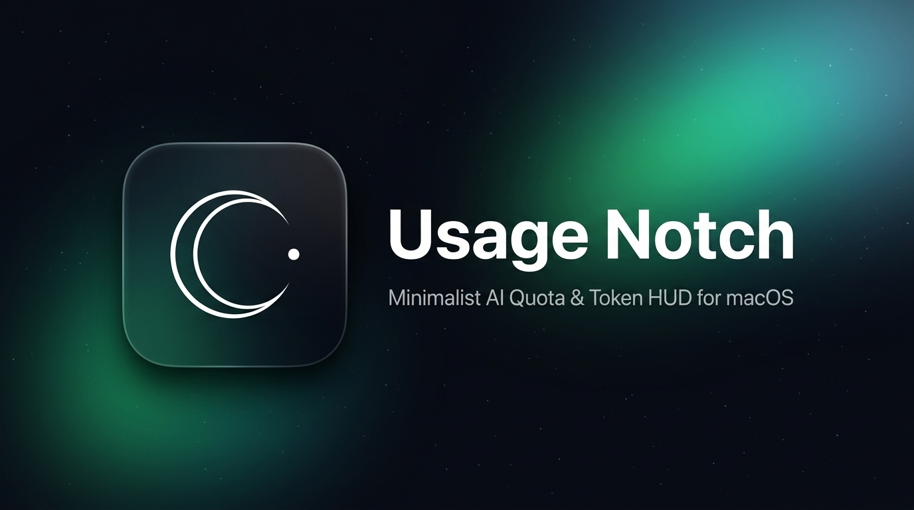

  

  
  
  
  

# Usage Notch 🚀

> **A minimalist native macOS HUD to monitor your AI assistant quotas & consumption directly from the screen bezel or notch.**

Built with 100% native Swift & SwiftUI for MacBook power users and developers. Compatible with macOS Sonoma, Sequoia, and macOS 15+.

---

## ✨ Features

- **Micro Bubble Resting Mode**: Stays pinned as an ultra-compact 48px curved tab at your screen edge. Takes up zero workflow space and never blocks Chrome, Finder, or your active apps.
- **Click-to-Expand HUD**: Smooth spring animation on click reveals live consumption across:
  - **Claude** (Anthropic live rate limits & Pro 5h session cycles)
  - **Cursor** (Live fast requests via Cursor API endpoint)
  - **Antigravity** (Google Gemini & OpenRouter token balance)
  - **Claude Code** (CLI session token budgets)
  - **Kiro** (Bearer token & custom API endpoints)
- **Zero Auto Layout Hangs**: Modern two-panel overlay architecture ensuring 120Hz ProMotion fluidity with zero CPU overhead.
- **Fully Customizable Placement**:
  - Right Display Edge
  - Left Display Edge
  - Top MacBook Notch / Menu Bar
  - Vertical height fine-tune slider (±250px) to prevent collision with desktop files.
- **App Store & Sandboxing Compliant**: Direct HTTPS requests, zero unauthorized file system snooping, and secure local credential storage.

---

## 🛠️ Architecture

- **`NotchOverlayController`**: Manages the borderless floating panels (`NSPanel`) at `.statusBar` level.
- **`APIUsageService`**: Handles secure live API queries to Cursor (`/api/usage`), Anthropic (`/v1/models`), and OpenRouter.
- **`UsageManager`**: Central state engine for tracking percentages, reset countdown timers, and positioning.
- **`SettingsWindowController`**: Native preferences window for connecting API keys or setting manual quotas.

---

## 🚀 Getting Started

1. Open `CoderBar.xcodeproj` in Xcode 16+.
2. Select your Mac as the destination.
3. Press **⌘ + R** to build and run.
4. Click the gear icon on the notch or press **⌘ + ,** to configure your API keys in Preferences.

---

## 🔒 Privacy Policy

Usage Notch is built with a strict **privacy-first, local-first** architecture. We collect zero personal data, zero analytics, and zero telemetry. All API credentials and usage metrics remain stored exclusively on your Mac.

Read the full [Privacy Policy](PRIVACY_POLICY.md) (compliant with Apple App Store Review Guideline 5.1.1).

---

## 📄 License

MIT License. Crafted for developers.
